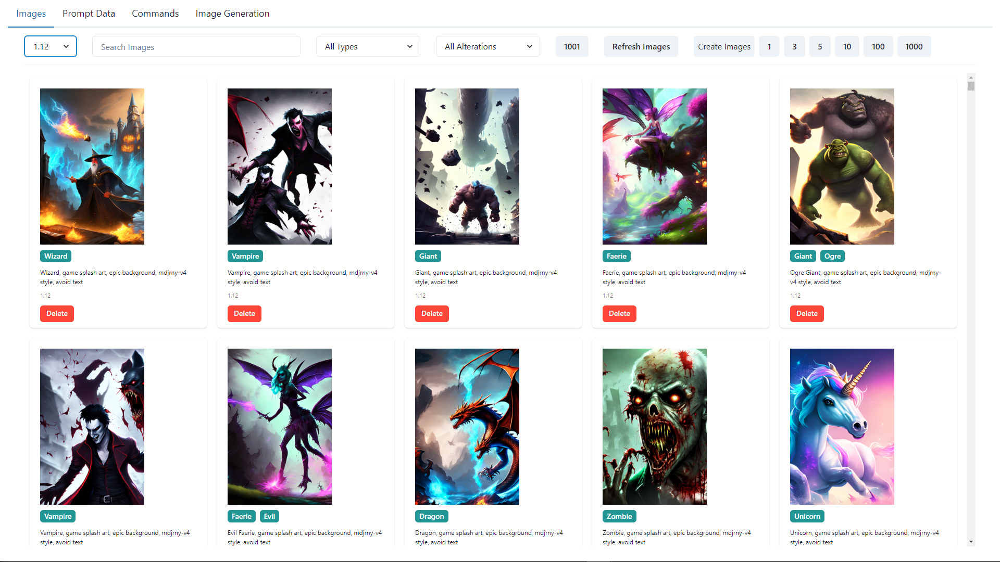
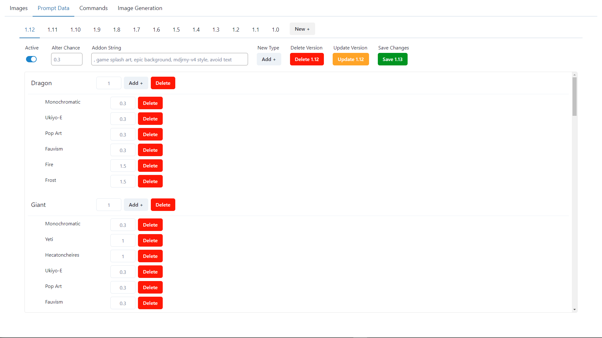

# Admin Dashboard

This project is an Admin Dashboard built with React, TypeScript, and Vite. It includes features for image management, prompt data handling, and image generation for the mythelix app.

This dashboard can be used to interact with [Mythelix Admin Server](https://github.com/Morgs27/mythelix-admin-server).

To create images [Mythelix Image Generator](https://github.com/Morgs27/mythelix-image-generator) will also be required.





## Getting Started

1. Install dependencies:

   ```bash
   npm install
   ```

2. Set up environment variables:
   Update the `.env` file in the root directory with the following:

   ```bash
   VITE_ADMIN_PASSWORD="password for the admin user"
   VITE_TEST_PASSWORD="password for the test user"
   VITE_SERVER_URL="url of the backend server"
   ```

3. Start the development server:

   ```bash
   npm run dev
   ```

   The app will be available at `http://localhost:5173` (or the port specified by Vite).

## Authentication

The app uses a simple authentication system. Users are defined in `AuthService.ts` and passwords are stored as environment variables.

## API Configuration

The app communicates with a backend server. The server URL is configured in `server.ts` using the `serverUrl` environment variable.

## Building for Production

To create a production build:

```bash
npm run build
```

The built files will be in the `dist` directory.

## Docker Deployment

This project includes a Dockerfile for containerized deployment. The Dockerfile uses a multi-stage build process to create a smaller, production-ready image.

1. Build the Docker image:

   ```bash
   docker build -t admin-dashboard .
   ```

2. Run the container:

   ```
   docker run -p 8080:8080 admin-dashboard
   ```

   The app will be available at `http://localhost:8080`.
